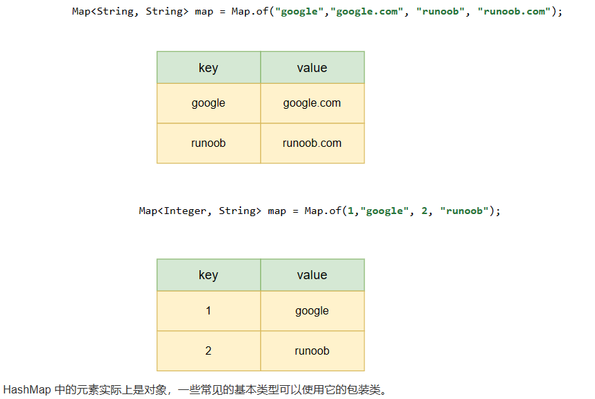

#### 解法一：暴力破解

```java
int[] last = new int[128];
int n = s.length();
int res = 0;
int start = 0; // 窗口开始位置
for(int i = 0; i < n; i++) {
    int index = s.charAt(i);    //输出为ASCII值，例：a的ASCII为65
    start = Math.max(start, last[index] + 1);
    res   = Math.max(res, i - start + 1);
    last[index] = i;
}
return res;
```

##### 解析：

定义一个新的数组（last），for运行标准，输入s=[a,b,c,a,b]

|     i      | last[index] |  start   |    res     | last[index]=i | index |
| :--------: | :---------: | :------: | :--------: | :-----------: | :---: |
|   初始化   |             |    0     |     0      |               |       |
|     0      | last[65]=0  | 1(1,0+1) | 0(0,0-1+1) | last[65]=i=0  | 65(a) |
|     1      | last[66]=0  | 1(1,0+1) | 1(0,1-1+1) | last[66]=i=1  | 66(b) |
|     2      | last[67]=0  | 1(1,0+1) | 2(1,2-1+1) | last[67]=i=2  | 67(c) |
|     3      | last[65]=0  | 1(1,0+1) | 3(2,3-1+1) | last[65]=i=3  | 65(a) |
|     4      | last[66]=1  | 2(1,1+1) | 3(3,4-2+1) | last[66]=i=4  | 66(b) |
| return res |             |          |     3      |               |       |

如果s=[a,b,c,a,b,a]，则前几步，i循环到5结束，如下：

|     i      | last[index] |  start   |    res     | last[index]=i | index |
| :--------: | :---------: | :------: | :--------: | :-----------: | :---: |
|     5      | last[65]=3  | 4(2,3+1) | 3(3,5-4+1) |  last[65]=5   | 65(a) |
| return res |             |          |     3      |               |       |

可以看到重复的字符串数仍然是3。


###### charAt（i）

获取字符串中下标为i的字符：

源码：

```java
public char charAt(int index) {
    if ((index < 0) || (index >= value.length)) {
        throw new StringIndexOutOfBoundsException(index);
    }
    return value[index];
}
```

例：

```java
String s = "abcde";
System.out.println(s.charAt(1));
```

输出：

`b`

#### 方法二：暴力破解

```java
class Solution {
    public int lengthOfLongestSubstring(String s){
        int res = 0;
        for(int i = 0;i < s.length();i++) {
            boolean[] book = new boolean[300];
            for (int j = i; j >= 0; j--) {
                if (book[s.charAt(j)])
                    break;
                book[s.charAt(j)] = true;
                res = Math.max(res, i - j + 1);
            }
        }
        return res;
    }
}
```

##### 解析：

类似于**方法一**

boolean类型只有两个值：true、false

```java
Boolean b1 = new Boolean(true);
Boolean b2 = new Boolean("ok");
Boolean b3 = new Boolean("true");
System.out.println(b1);   //true
System.out.println(b2);   //false
System.out.println(b3);   //true

//下面存在StringIndexOutOfBoundsException，但是不影响查看结果输出，后续在解决异常问题
String s = "abcd";
int length = s.length();
boolean[] book = new boolean[300];
for(int i = 0; i <= length; i++){
	System.out.println(book[s.charAt(i)]);  //皆为false
}
```


#### 方法三：滑动窗口

```java
/**写法一**/
class Solution {
    public int lengthOfLongestSubstring(String s) {
        // 哈希集合，记录每个字符是否出现过
        Set<Character> occ = new HashSet<Character>();
        int n = s.length();
        // 右指针，初始值为 -1，相当于我们在字符串的左边界的左侧，还没有开始移动
        int rk = -1, ans = 0;
        for (int i = 0; i < n; ++i) {
            if (i != 0) {
                // 左指针向右移动一格，移除一个字符
                occ.remove(s.charAt(i - 1));
            }
            while (rk + 1 < n && !occ.contains(s.charAt(rk + 1))) {
                // 不断地移动右指针
                occ.add(s.charAt(rk + 1));
                ++rk;
            }
            // 第 i 到 rk 个字符是一个极长的无重复字符子串
            ans = Math.max(ans, rk - i + 1);
        }
        return ans;
    }
}

/**写法二**/
class Solution{
    public int lengthOfLongestSubstring(String s) {
        HashMap<Character, Integer> rempos = new HashMap<>();
        int res = 0;
        //i是头指针，j是尾指针
        for(int i = 0,j = 0;i < s.length();i++){
            //这个字符出现过
            if(rempos.containsKey(s.charAt(i)))
                //j更新位置，如果这个字符上次出现的位置在j的后方，则j后移，否则不动。
                j = Math.max(j,rempos.get(s.charAt(i)));               
            res = Math.max(res,i - j + 1);  //获取未重复字符串的最大值
            rempos.put(s.charAt(i),i + 1);  
        }
        return res;
    }
}
```

##### 解析：

假设存在字符串abcabcbb，找出每一个字符开始，不包含重复字符的最长子串

- 以 (a)bcabcbb 开始的最长字符串为 (abc)abcbb；
- 以 a(b)cabcbb 开始的最长字符串为 a(bca)bcbb；
- …..

以此类推，这样一来，我们就可以使用「滑动窗口」来解决这个问题了：

- 我们使用两个指针表示字符串中的某个子串（或窗口）的左右边界，其中左指针代表着「枚举子串的起始位置」，而右指针即为最长字符串的结束位置

- 在每一步的操作中，我们会将左指针向右移动一格，表示 我们开始枚举下一个字符作为起始位置，然后我们可以不断地向右移动右指针，但需要保证这两个指针对应的子串中没有重复的字符。在移动结束后，这个子串就对应着 以左指针开始的，不包含重复字符的最长子串。我们记录下这个子串的长度；


- 在枚举结束后，我们找到的最长的子串的长度即为答案。


###### HashMap

- 是一个散列表，它存储的内容是键值对(key-value)映射
- 实现Map接口，根据键的 HashCode 值存储数据，具有很快的访问速度，最多允许一条记录的键为 null，不支持线程同步。
- 继承于AbstractMap，实现了 Map、Cloneable、java.io.Serializable 接口
- 是无序的，即不会记录插入的顺序



```java
// 引入 HashMap 类      
import java.util.HashMap;

public class RunoobTest {
    public static void main(String[] args) {
       // 创建 HashMap 对象 Sites
        HashMap<Integer, String> Sites = new HashMap<Integer, String>();
        // 添加键值对  注意添加重复key值位，value会被覆盖
        Sites.put(1, "Google");
        Sites.put(2, "Runoob");
        Sites.put(3, "Taobao");
        Sites.put(4, "Zhihu");
        System.out.println(Sites);  //{1=Google, 2=Runoob, 3=Taobao，4=Zhihu}
        System.out.println(Sites.get(3));  //taobao get(key) 方法来获取 key 对应的 value
        Sites.remove(4); //remove(key) 方法来删除 key 对应的键值对(key-value)
        System.out.println(Sites); //{1=Google, 2=Runoob, 3=Taobao}
        ......
        Sites.clean();  //删除所有值
        Sites.size();   //计算元素数量
        /**迭代**/
        // 输出 key 和 value
        for (Integer i : Sites.keySet()) {
            System.out.println("key: " + i + " value: " + Sites.get(i));
        }
        /**
        	key: 1 value: Google
			key: 2 value: Runoob
			key: 3 value: Taobao
			key: 4 value: Zhihu
        **/
        // 返回所有 value 值
        for(String value: Sites.values()) {
          // 输出每一个value
          System.out.print(value + ", ");
        }
        /**
        	Google, Runoob, Taobao, Zhihu,
        **/
    }
}
```


###### HashSet

基于HashMap来实现，是无序的，线程不安全。不允许有重复元素的集合，同时允许有null值

```java
// 引入 HashSet 类      
import java.util.HashSet;

public class RunoobTest {
    public static void main(String[] args) {
    HashSet<String> sites = new HashSet<String>();  //实例化
        sites.add("Google");
        sites.add("Runoob");
        sites.add("Taobao");
        sites.add("Zhihu");
        sites.add("Runoob");  // 重复的元素不会被添加
        System.out.println(sites);  //[Google, Runoob, Zhihu, Taobao]
        System.out.println(sites.contains("Taobao"));  //true，contains()方法判断元素是否存在于集合中
        sites.remove("Taobao");  // remove()删除元素，删除成功返回 true，否则为 false
        System.out.println(sites);  //[Google, Runoob, Zhihu]
        System.out.println(sites.size());  // 3 ，size()计算元素数量
        sites.clear();  //clean()删除所有元素
        System.out.println(sites);
    }
}
```

