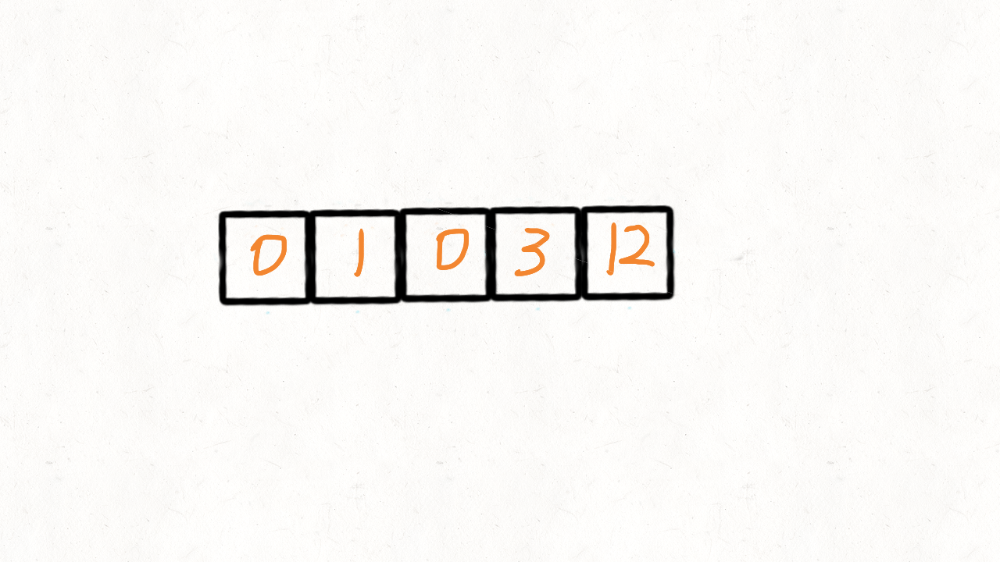

```java
	class Solution {
        public void moveZeroes(int[] nums) {
            if(nums==null) {
                return;
            }
            //两个指针i和j
            int j = 0;
            for(int i=0;i<nums.length;i++) {
                //当前元素!=0，就把其交换到左边，等于0的交换到右边
                if(nums[i]!=0) {
                    int tmp = nums[i];
                    nums[i] = nums[j];
                    nums[j++] = tmp;
                }
            }
//            int j = 0;
//            for (int i = 0; i < nums.length; i++) {
//                if (nums[i] != 0) {
//                    nums[j++] = nums[i];
//                }
//            }
//            for (int i = j; i < nums.length; ++i) {
//                nums[i] = 0;
//            }
        }
    }
```

**图解:**

